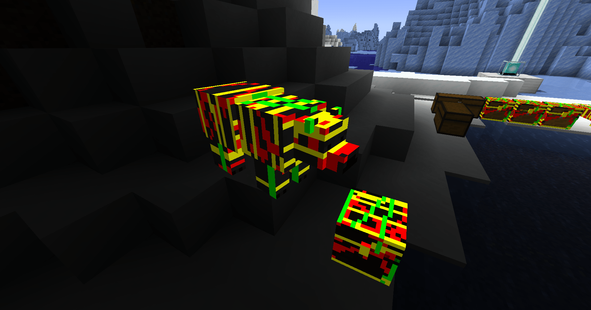
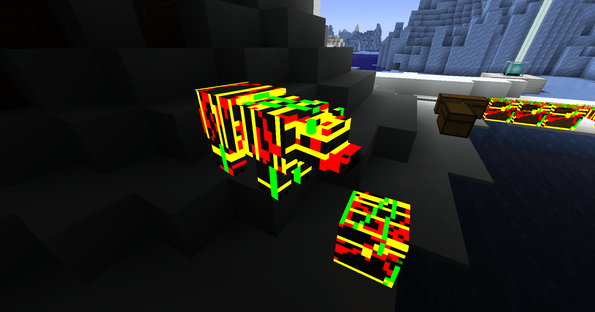
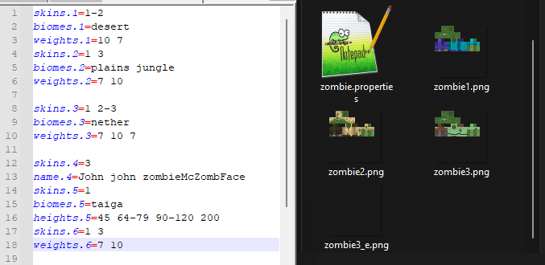

# 💡 Emissive textures

## OptiFine compatability

- ETF supports all OptiFine emissive texture resource packs
- A custom emissive texture suffix may be set just like OptiFine but with a few optional changes, see the [emissive.properties](emissive.properties) example.
- Please try and use only the default emissive suffix `_e`, it makes things easier for everyone :)

## Guide

- Emissive textures allow parts of a mob / entity's texture to glow as in the image above
- An emissive texture is a copy of the regular mob texture including only the parts you want glow
- To render correctly, the emissive texture should be the exact same size as the original mob's texture, otherwise you may get Z-Fighting with shaders enabled
- Emissive textures must be in the same folder as the texture it is glowing over and must be named like this: `TextureName#.png`, with `#` being the suffix set by the topmost OptiFine format resource pack,otherwise it will default to `_e` (Meaning that the file name should be `TextureName_e.png`)
- Elytra & armour emissives have CIT Resewn mod support and will apply based on the CIT texture
- Tridents support emissive textures and can be customized via the special case rules in the [`random / custom mob guide`](RANDOM_GUIDE.md)
- Block entities such as chests, shulker boxes, beds, bells, enchanting table & lectern books **support** emissive textures with ETF, other blocks require [Continuity](https://modrinth.com/mod/continuity)
  - Enhanced Block Entities (A mod which changes the block entity render to block render for performance optimizations) breaks ETF's support for block entities 
- Player skins support emissive textures, see the [`player skin features guide`](SKINS.md)

---
 ## Armor trims

 Emmisive armor trim textures are defined just like in OptiFine, by adding one of the following material suffixes
 
to the trim base name: amethyst, copper, diamond, diamond_darker, emerald, gold, gold_darker,
iron, iron_darker, lapis, netherite, netherite_darker, quartz, redstone.
 
For example:

`textures/trims/models/armor/coast_amethyst_e.png`,
`textures/trims/models/armor/host_iron_darker_e.png`,
`textures/trims/models/armor/dune_leggings_netherite_e.png`

You can also add a copy of the non emissive texture present in the same path to override that trim.

For example:

`textures/trims/models/armor/coast_amethyst.png`,
`textures/trims/models/armor/host_iron_darker.png`,
`textures/trims/models/armor/dune_leggings_netherite.png`
---

Emissive textures can render in two different ways, set by the config. The two images below show the two rendering modes:

### Dull Emmisives [default]

<table>
<tr>
<td>

</td>
<td>

They:

- Are like OptiFine emissives
- Are not overly bright in sunlight
- Have directional light shading (some sides are shaded differently)
- Have an upper brightness limit more inline with typical entity rendering
- Are expected to be more stable with certain shaders

Block entities will always use this mode unless Iris is installed, due to rendering issues in vanilla

</td>
</tr>
</table>

### Bright Emissives

<table>
<tr>
<td>

</td>
<td>

They:

- Are brighter than OptiFine emissives
- Are noticeably bright in sunlight and can look out of style with vanilla
- Typically, have more bloom with shaders
- Have global illumination and do not shade differently over the model
- Are brighter than the default Dull Emissives
- More likely to break with certain shaders enabled

</td>
</tr>
</table>

## Examples

- The example image above shows red glowing eyes for the texture `zombie3.png`
- Emissives are applied after randomised textures and they must contain the same number system as the random files they apply too. For example, `zombie_e.png` will not apply to `zombie3.png`, but `zombie3_e.png` will.
