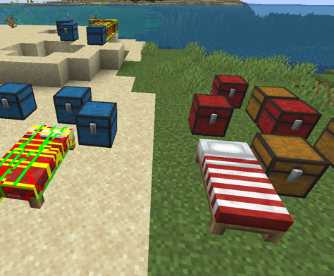
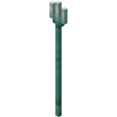
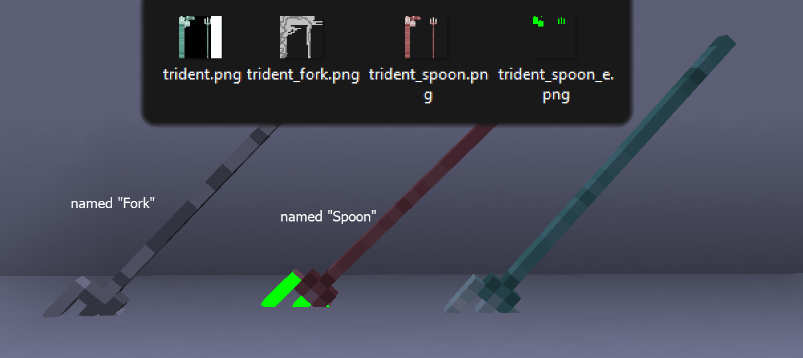
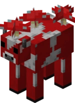
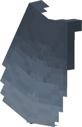
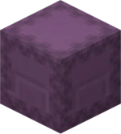
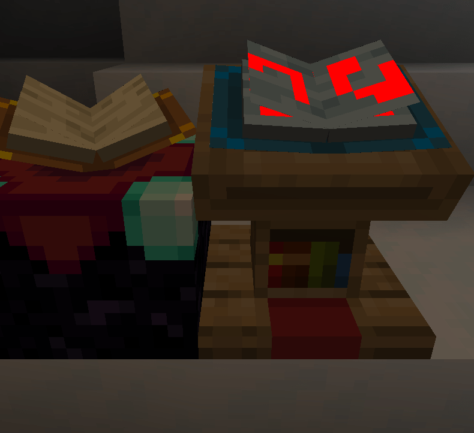
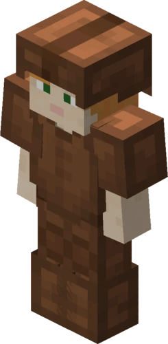

# 🎲 Custom / random textures

<div align="center">


</div>

## OptiFine compatability

- ETF supports all OptiFine random entity texture properties including `biome`, `name`, `height` etc.
- The documentation is availiable in the [`random_entities.properties`](random_entities.properties) example file.
- ETF also adds a few extra features that OptiFine does not have. For instance, random entity files can also be placed under the vanilla `/assets/minecraft/textures/entity` or ETF directory, `/assets/etf/random/` directory as well as OptiFine's directories.

## Guide:

- Random textures must be in one of the following folders of a resource pack.
<br />ETF will check from the top directory first and will only use the last directory if none of the others are used:
    - The ETF directory `etf/random/entity`
    - The OptiFine random directory `optifine/random/entity`
    - The OptiFine legacy directory `optifine/mob`
    - The vanilla directory `minecraft/textures/entity` or wherever a modded entity's texture happens to be by default.

- The random textures must be named after this format: `TextureName#.png`, with `#` being any number that should start from **2**.  
If `TextureName1.png` does not exist then calling `1` in the properties will use the vanilla texture
<br />(The vanilla texture can also be manually called by using number `0`)

- A `TextureName.properties` file can be placed alongside these random textures to determine special cases for different random textures to be selected.
This properties file must support the [ETF/OptiFine format](random_entities.properties) and if one isn't present,
the game will instead pick randomly from the available random textures present. When picked randomly, the random textures must contain numbers in sequence from `2` -> however many there are. If there are any gaps, then textures after the gap will be ignored

- The properties file functions exactly like OptiFine and if a specific entity does not match any of the conditions in the properties file it will default to the vanilla texture.

- ETF also adds a few texture properties beyond what optifine can do: `names`, `blocks`, `teams`, `speed`, `jumpStrength`, `maxHealth`, `llamaInventory`, `hiddenGene`, `playerCreated`, `screamingGoat`, `distanceFromPlayer`, `creeperCharged` and `statusEffect` , as well as extending `colors` and other minor tweaks

  - The `names` property works the same way `name` property does, except it will allow you to set multiple names for a condition a little easier

  - The `blocks` property works the same way `biomes` property does except it will allow you to set the texture of the entity based on the block it spawned on (or first rendered on). It also checks the block it spawns to allow things like `water`, `cave_air`, `flowers` etc. to be used. Example: `blocks.1= stone !bedrock minecraft:stone mod_name:marble oak_sapling`
  
  - The `teams` property works the same way `names` property does, except it will allow you to set the texture of the entity based on the scoreboard team it's in. Example: `teams.1= !red_team "Blue Team" blue_team`

  - Additionally, the `names` & `teams` properties support grouping names that have spaces within double quotes (e.g "John Smith")

  - These and the rest of the properties added by ETF are documented with examples [`here`](random_entities.properties)

- Mobs with additional textures like `sheep` & `wool`, `horse` & `markings` & `armour`, `iron_golem` & `cracking_textures` etc. will have the additional texture to try and match whatever variant the main texture uses. For example a sheep using `sheep2.png` will try to use `wool2.png` and if that doesn't exist it'll use the default texture

- Villagers are an exception to the above rule. Each villager texture will apply their own rules, whether they'll be randomly assigned or set by a properties file

## Examples

<div align="center">


</div>

#### The example image above shows that:

- Any zombie in a desert will have a 10/17 chance of using `zombie1.png`

- Any zombie not in a desert, plains, jungle or nether biome and is named `John` will always use `zombie3.png`

- Any zombie in a `taiga` biome without the names above and standing at Y level 45 will use `zombie1.png`

- `zombie3.png` has an emissive texture, `zombie3_e.png`, that will make its eyes glow red

---

- Certain conditions in the properties file will update the mob's texture based on the texture update speed. These properties are:<br />
`name`, `profession`, `collarColors`, `baby`, `health`, `teams`, `distanceFromPlayer`, `creeperCharged`
 
- All the other conditions such as `biomes` & `blocks` will by default only be applied to the mob when it first spawns/loads. 
For example, a zombie spawned in a desert will take the desert texture and it will not change to the forest texture when they walk into a forest biome

  - This can be disabled by the config option <kbd>Property update restrictions</kbd> for each of these properties individually. 
    If update restrictions are disabled for `biomes`, the above example zombie with the desert texture would indeed change to the forest texture upon         entering a forest biome

- Entities with multiple textures like wolves, bees or ghasts should be given the same amount of random variant textures for each texture variant, however this is not mandatory.

## Special cases

<table>
<tr>
<td>

</td>
<td>

- Chests and beds are block entities and can be customized with the same properties format as OptiFine does for other entities

- Most block entity optimization Fabric mods such as [Enhanced Block Entities](https://modrinth.com/mod/ebe), [Better Beds](https://modrinth.com/mod/better-beds) and<br />[Fast Chest](https://github.com/FakeDomi/FastChest) will disable this feature due to their mechanics changing the block entity rendering to<br />block rendering

- The `name` property for chests and other block entities will not work on servers, unless the server<br />has a mod like [Know my name!](https://modrinth.com/mod/know-my-name)

</td>
</tr>
<tr>
<td>
<div align="center">

</div>
</td>
<td>
<br />
<div align="center">

</div>
<br />

- Tridents support custom textures (as of v.2.3.0). A trident item named "Bobby's Trident" will use the texture `trident_bobbys_trident.png`

- A named trident will match any texture of the format `trident_customName.png`, with `customName` being the name of the trident. Spaces are replaced with `_` and any non `a-z or A-Z` characters are ignored.

- Custom trident support will be removed if implemented in a mod like [CIT Resewn](https://modrinth.com/mod/cit-resewn).

</td>
</tr>
<tr>
<td>
<div align="center">

</div>
</td>
<td>

- If a custom mushroom texture is placed in `minecraft/textures/entity/cow/red_mushroom.png` or `minecraft/textures/entity/cow/brown_mushroom.png`, it'll overwrite the mushrooms on the back of the respective mooshroom.

</td>
</tr>
<tr>
<td>
<div align="center">

</div>
</td>
<td>

- Custom elytras are handled by [CIT resewn](https://modrinth.com/mod/cit-resewn) and will utilise ETF emissive textures only

- You can also use the player skin feature options for custom capes to have a custom elytra. This does support emissive elytras based on what pixels are emissive in your skin.

</td>
</tr>
<tr>
<td>
<div align="center">

</div>
</td>
<td>

- Shulkers will **only** use the base uncoloured `shulker.properties` for custom settings (**not** `shulker_black.properties`!). The other coloured textures will still apply as the default to those entities when spawned via commands
- Shulker boxes will use `shulker.properties` or `shulker_black.properties`, depending on the shulker box colour
- If you'd like to prevent wild shulkers from using custom textures intended for shulker boxes, you can add the following at the start of `shulker.properties`:

```
skins.1=1
biomes.1=the_end
```

  - This should make all shulkers and shulker boxes in `the_end` appear as default, you can find an example in the example ETF vanilla resource pack
- Same with beds and chests, [Enhanced Block Entities](https://modrinth.com/mod/ebe), [Better Beds](https://modrinth.com/mod/better-beds) and [Fast Chest](https://github.com/FakeDomi/FastChest) will disable this feature due to the way they work

- Again, the `name` property for shulker boxes and other block entities won't work on servers, unless the server has a mod like [Know my name!](https://modrinth.com/mod/know-my-name)

</td>
</tr>
<tr>
<td>
<div align="center">

</div>
</td>
<td>

- If a custom book texture is placed in `minecraft/textures/entity/lectern_book.png`, it'll overwrite the book of the lectern

</td>
</tr>
<tr>
<td>
<div align="center">

</div>
</td>
<td>

- Armor can be customized using [CIT Resewn](https://modrinth.com/mod/cit-resewn) **only**, as it allows greater customization and makes more sense as the armor is an item

- ETF _will_ provide emissive support for CIT customized armor textures

</td>
</tr>
</table>
