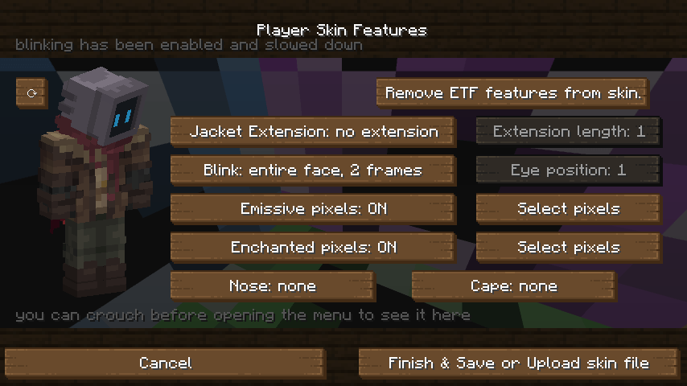
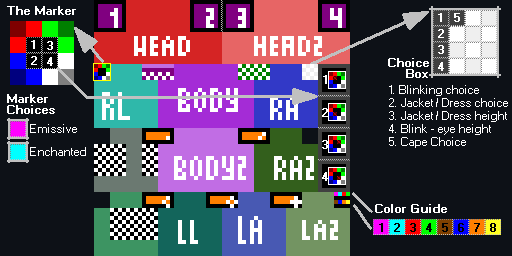
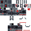
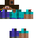
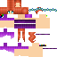

# 🎨 Player skin features 

<div align="center">

 <br />
<br />
<br />


 </div>
 
- Player skins can use emissive, blinking, enchanted, and transparency texture features and more...
- They are 100% optional, controlled by the skin file you upload to Mojang. ETF also provides options to prevent abuse of such features in PvP

## Adding them to your skin

### The easy way (_v.4.1+_): 

<div align="center">



</div>

- Skin features can be selected from the Skin Tool in ETF's settings available via Mod Menu and/or the ETF button in the resource pack menu
- After choosing your features you can either upload them directly to Mojang from the tool or save the skin image and it upload yourself

<div align="center">

 <details><summary><h2>The manual way:  [click to open]</h2><br /><h4>(The manual documentation can be confusing, please contact us in the <a href="https://discord.com/invite/rURmwrzUcz">Discord server</a> if you get stuck)</h4></summary>



<div align="left">

## Getting started

- First to enable the skin features in this mod you **must** put the marker in your skin file, this is the
  red,green,blue,white,black pixels just below the head texture in the example image above.

<table> 
<tr>
<td>

ETF can do this step for you **automatically** as of V2.7.0, simply open the mod menu settings and enable *"Apply skin
feature template to a copy of your skin"* then open a world enter third person & press F3+T. You will see a message in
chat when it is done, and you will find a copy of your skin in the minecraft directory folder called *"
ETF_player_skin_printout.png"* that has the example template applied to it ready for the next steps after getting
started.

</td>
</tr>
</table>

- This mod will ignore any skin without this so no one else can affect **YOUR** skin
- You will select your marker choices later these will be selected by putting specific colour pixels in the black boxes
  numbered 1 - 4 in the top left of the example image.   
  *(Note: these 4 boxes point to four other numbered boxes on the right-hand side of the example skin.)*
- The choices Box is the white and grey checkered box in the example image, it has been expanded into the top right to
  show you the numbers of those pixels you will fill this in later with specific pixel colours to select options for
  your skin
- The Color Guide at the bottom right is not required - it is provided in the example skins for you to grab the specific
  colors required for later choices. *(Note: each color corresponds to a number, this will be used later)*

- It is **highly** recommended you leave every unused pixel in your skin texture blank and transparent,
  if you have stray pixels filled they may accidentally trigger future added features

- I will promise now. As long as you leave unused parts of your skin file
  blank and transparent no future update will impact your skin unexpectedly.

___

## Transparency - [V2.3.0+]

- If the marker is present in your skin, you will then be able to use transparency in the head, body,RLeg, LLeg,RArm,
  and LArm, body parts *(this is disabled in vanilla)*.
- The total skin can not be less than 40% average transparency to prevent possible PVP abuse, an option has been added
  to override this for fun and only affects your point of view.
- Transparency can be separately Disabled for enemy team players to not be abused in PVP settings.  
  
  
- See examples above in the Ghost, Slime, Steve, Chicken, Skeleton, and Among us skins.

---

## Emissiveness / Glowing pixels - [V2.3.0+]

- If the marker is present in your skin, you will then be able to use emissiveness in your skin
- To enable Emissiveness you **must** choose **only one** numbered pixel
  in the marker and give it the Emissive color *(the pink in the marker choices list)  
  (for example putting the pink color in #1 in the marker will select all the pixels in the corresponding
  box to the right side of the skin with a #1, and a picture of the marker, in it. that box will be selected for
  emissive pixels)*
- After choosing a box on the right like this,
  any pixels present in that box will make identical pixels in the rest of the skin glow.  
  
- See examples above in the Ghost, Robot, and Thanos's gauntlet

---

## Enchanted pixels - [V2.3.0+]

- If the marker is present in your skin, you will then be able to use enchanted pixels in your skin
- To enable enchanted pixels you **must** choose **only one** numbered pixel
  in the marker and give it the Enchanting color *(the cyan in the marker choices list)  
  (for example putting the cyan color in #2 in the marker will select all the pixels in the corresponding
  box to the right side of the skin with a #2, and a picture of the marker, in it. that box will be selected for
  enchanted pixels)*
- After choosing a box on the right like this,
  any pixels present in that box will make identical pixels in the rest of the skin appear enchanted.  
  
- See examples above in the Alex, robed figure, and Thano's arm skins

---

## Blinking - [V2.3.0+]

- If the marker is present in your skin, you will then be able to have your skin blink periodically, but you must also
  choose what style of blinking,

```
- 1 pixel height Eyes      [V2.4.4+]
- 2 pixel height Eyes      [V2.4.4+]
- 3-4 pixel height Eyes    [V2.4.4+]
- Whole face texture blink 
```

#### 1 pixel blinking - [V2.4.4+]

If your skin's eyes are only 1 pixel tall - use this.

- First place a Red #3 pixel in Choice Box pixel #1 to enable 1 pixel blinking
- Then make a copy of the horizontal line of the skin's face where the eyes are, and change the
  eyes to be closed.
- Place this "closed eye copy" in the same place as the light purple line below the head in the Example Image.
- Next the mod needs to know where your eyes are, place a numbered Color from the Color Guide in Choice Box #4
  corresponding to the height of the skin's eyes   
  *(The head texture is 8 pixels tall with #1 being the top line of the head & #8 being the bottom)*  
  *(For Example Default Steve's eyes are at line #5, so you would place the Brown #5 pixel in Choice Box #4)*
- You are now done, the mod will take the light purple line below the head texture
  and replace your skin's eyes with it when it blinks  
  
- This skin uses the 1 pixel blinking

#### 2 pixel blinking - [V2.4.4+]

If your skin's eyes are only 2 pixels tall - use this.

- First place a Green #4 pixel in Choice Box pixel #1 to enable 2 pixel blinking
- Then make 2 copies of the 2 horizontal lines of the skin's face where the eyes are, and change 1 copy's
  eyes to be closed, and the other's eyes to be half closed.
- Place the "closed eye copy" in the same place as the light purple line & the purple line below the head in the Example
  Image.
- Place the "half closed eye copy" in the same place as the white / purple checkered area below the head in the Example
  Image.
- Next the mod needs to know where your eyes are, place a numbered Color from the Color Guide in Choice Box #4
  corresponding to the height of the skin's eyes topmost pixel   
  *(The head texture is 8 pixels tall with #1 being the top line of the head & #8 being the bottom)*  
  *(For Example Default Steve's eyes are at line #5, so you would place the Brown #5 pixel in Choice Box #4)*
- You are now done, the mod will take the appropriate eye copy below the head texture
  and replace your skin's eyes with it when it blinks  
  
- This skin uses the 2 pixel blinking

#### 3-4 pixel blinking - [V2.4.4+]

If your skin's eyes are only 3-4 pixels tall - use this.  
This actually only supports 4 pixels, but you can simply copy an additional *non-eye* line of the face if your eyes are
3 pixels high, and it will work fine :)

- First place a Brown #5 pixel in Choice Box pixel #1 to enable 4 pixel blinking
- Then make 2 copies of the 4 horizontal lines of the skin's face where the eyes are, and change 1 copy's
  eyes to be closed, and the other's eyes to be half closed.
- Place the "closed eye copy" in the same place as the pink & purple & checkerboard area below the head in the Example
  Image.
- Place the "half closed eye copy" in the same place as the white / green checkered area below the head's 2nd layer in
  the Example Image.
- Next the mod needs to know where your eyes are, place a numbered Color from the Color Guide in Choice Box #4
  corresponding to the height of the topmost pixel of the face you copied from *(where the eyes were)*   
  *(The head texture is 8 pixels tall with #1 being the top line of the head & #8 being the bottom)*  
  *(For Example Default Steve's eyes are at line #5, so you would place the Brown #5 pixel in Choice Box #4)*
- You are now done, the mod will take the appropriate eye copy below the head textures
  and replace your skin's eyes with it when it blinks  
  
- This skin uses this 3-4 pixel blinking

#### Whole face texture blinking

The whole face blinking option is the easiest way to do skin blinking but will use more space in the texture
and may limit what features can be used in the future, this is only recommended for eyes larger than
4 pixels or not 'typical' eyes

- First choose what kind of blinking you want, many skins have large eyes, so to smooth out blinking
  you can have either
- 1 frame of blinking (eye open & eye closed) or 2 frames (eye open & eye half closed & eye closed)
- to select one you must change the colour of Choice Box pixel #1 in the example above
- to Select 1 frame you must use exactly the Pink pixel #1 from the Color Guide, for 2 frames
  use the Light Blue #2 instead
- Once this is done you can now add blinking textures to your skin, make a copy of the front of
  your face and put it in the purple box with a #1 make this face have its eyes completely closed
- Repeat with the extra head layer for your face and put that in the purple box with #3, just in case you have pop-out
  eyes
- if you have selected a 2 frame blink repeat this process with purple boxes #2 & #4 except this time make the eyes half
  closed  
  
- You can see this in the Chicken & Slime Tuxedo skins

---

## Jacket / Dress Extensions - [V2.4.0+]


- This feature provides extension options for how minecraft renders the 'Jacket' layer of your minecraft
  skin *(the second layer that floats above your body)* and allows it to go up to 8 pixels further down
- Typical uses could be for Jackets, Dresses, Villager cloaks and Robes.
- The texturing is extremely straight forward, if enabled this feature will copy the contents of the top of the
  Legs floating skin layers and use them to build the extension *(these pixels are marked by a checkerboard pattern in
  the example image above)*.

To enable this feature **must** choose what ***Style*** of extension you want.  
This is done by putting a pixel of your choice in Choice Box #2, the numbers below correspond to the
colored pixels in the Color Guide

```
1. you will get the examples above where the extension is copied from the leg overlay which will still have the original texture.
2. the extension is still copied from the leg overlay, but it will also delete those pixels from the leg overlay texture itself leaving them clear.
3. same as #1 but with a wider extension
4. same as #2 but with a wider extension
5. same as #1 but will ignore the top of leg texture  [V2.4.4+]
6. same as #2 but will ignore the top of leg texture  [V2.4.4+]
7. same as #3 but will ignore the top of leg texture  [V2.4.4+]
8. same as #4 but will ignore the top of leg texture  [V2.4.4+]
```

Next you **must** choose what ***Length*** of extension you want.  
This is done by putting a pixel of your choice in Choice Box #3, The color of pixel you choose must
be one from the Color Guide.
The number for that color in the Color Guide will be the extension length from 1 to 8 pixels.

#### Example skins



---

## Villager Nose - [V2.4.5+]


- This feature provides the option to have a Villager nose
- All you need to do is add a villager nose *(six villager nose colored pixels)* into you skin's face or floating face
  section

  
*(this example has a villager nose and also has a working villager cloak using the jacket extension features)*
---

</div>

</details>

</div>
