## If you are looking to clone this repository, either for contributing or for personal use, you might want to check out [this guide](Cloning_or_contributing.md)

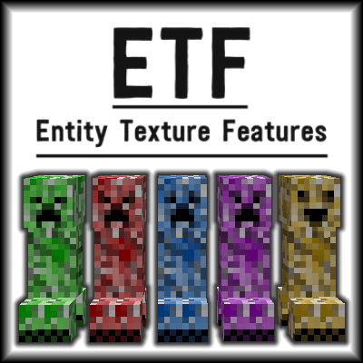

# Entity Texture Features

 

## 🤔 What does this mod do?

ETF is a Fabric *(Quilt compatible)* & Forge mod that adds many new _Entity Texture Features_, including entity and player skin features!  
This way, ETF achieves more OptiFine parity on the Fabric mod loader. If you want more OptiFine features on Fabric, you can either check [this list](https://lambdaurora.dev/optifine_alternatives), made by LambdaAurora, **or** you can use the [Fabulously Optimized modpack](https://modrinth.com/modpack/fabulously-optimized), which includes **all** the OptiFine parity mods!

## Featuring:

- [🎲](README-assets/RANDOM_GUIDE.md) Custom & random entity textures with the OptiFine format, including even more properties!
- [💡](README-assets/EMISSIVE_GUIDE.md) Emissive/glowing entity textures with the OptiFine format
- [😑️](README.md#-blinking-textures) Blinking mobs
- [🎨](README-assets/SKIN_GUIDE.md) Player skin features

## Compatibility

- OptiFine's random/custom or emissive entity resource packs -  **Fully compatable**
- [Entity Model Features](https://modrinth.com/mod/entity-model-features) -  **Fully compatible**
- [Sodium](https://modrinth.com/mod/sodium) -   **Fully compatible**
- [Iris Shaders](https://modrinth.com/mod/iris) -  **Fully compatible** (Support varies depending on the shader)
- Mod added entities -  **Compatible** (Only if the mod creator used the vanilla rendering code to render their mobs)

<h1>Wiki & guides [click to open]</h1>

## 🎲 Random / Custom entities

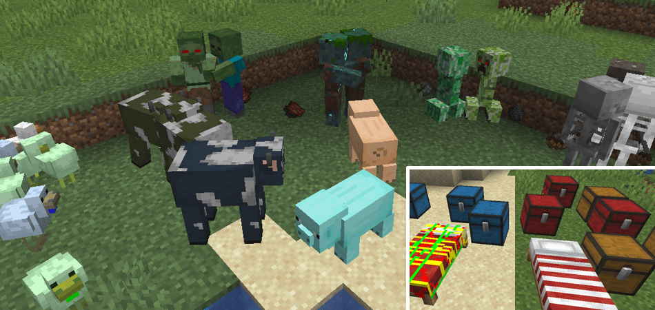

- For custom & random entity textures you can use a resource pack that supports the **OptiFine format**. ETF supports all OptFine custom and random entities, including all the properties and even more added by ETF!

#### [-> Random / custom entity textures guide <-](README-assets/RANDOM_GUIDE.md)

## 💡 Emissive entities

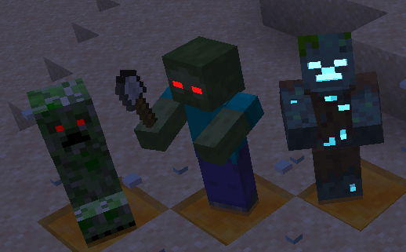

- For emissive & random entity textures you can use a resource pack that supports the **OptiFine format** and includes emissive entity textures. 

#### [-> Emissive entity textures guide <-](README-assets/EMISSIVE_GUIDE.md)

## 🎨  Player skin features

 
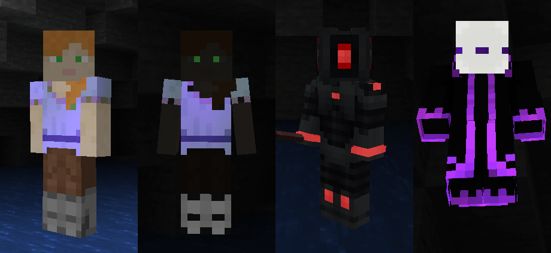 
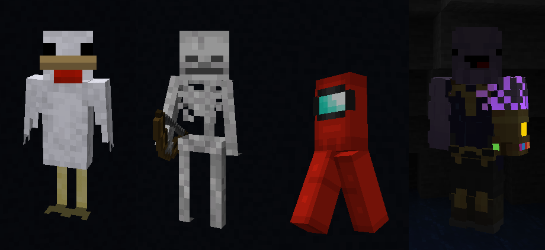 
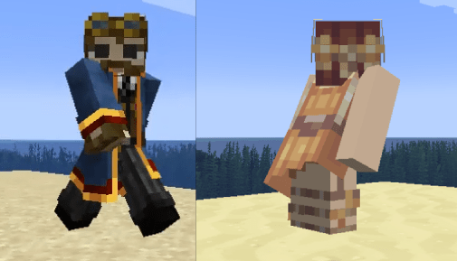 
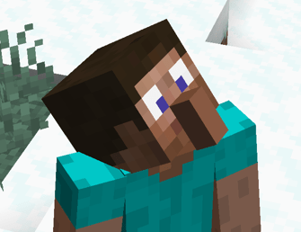
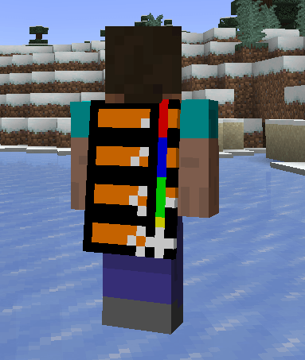
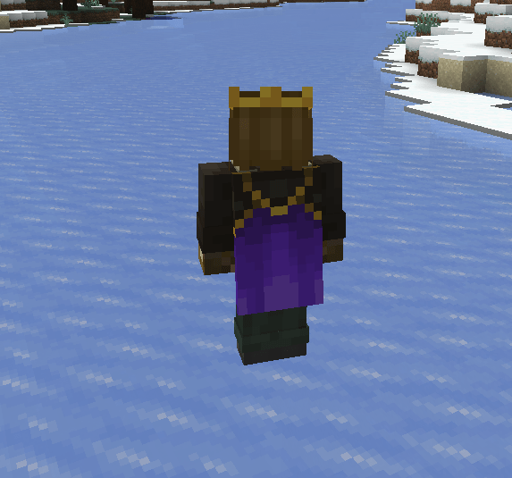

- Player skins can use emissive, blinking, enchanted, transparency texture features, as well as other cosmetics like capes, jackets, dress extensions and more
- They are 100% optional, controlled by the skin file you upload to Mojang and options to prevent abuse of features in PvP

  
#### [-> Player skin features guide <-](README-assets/SKIN_GUIDE.md)

## 😑 Blinking textures

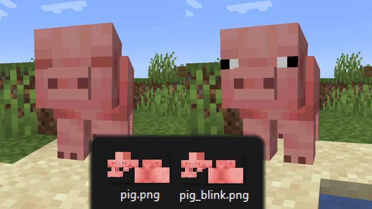

- Allows resource packs to add textures in order to make mobs blink over a customizable period of time.
- Mobs will blink periodically if they have a texture named `TEXTURE_blink.png`
- Optionally you can also use a texture named `TEXTURE_blink2.png` with the eyes half closed to achieve a smoother animation for large eyes
- Random blinking frequency can be altered in settings
- Sleeping mobs will have their eyes closed if possible
- Mobs with the blindness potion effect will have either their eyes closed or half closed depending on what is available
- Blinking _is_ supported on the player skin features
- Resource packs can set specific blinking length and frequency per texture via properties files next to the blinking texture:

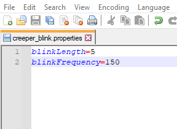

## Examples

<a href="https://www.curseforge.com/minecraft/texture-packs/entity-texture-features-example-pack">
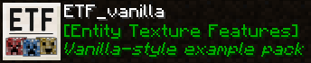
</a> 
<a href="https://www.planetminecraft.com/texture-pack/creepers-plus-optifine-required/">
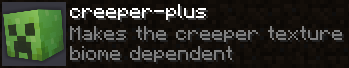
</a> 
<a href="https://www.curseforge.com/minecraft/texture-packs/tissous-zombie-pack-optifine-1-7x-1-19">
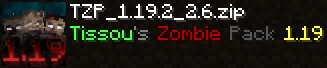
</a>

## Settings & configuration

- Settings can be changed in-game using [Mod Menu](https://modrinth.com/mod/modmenu), the settings button in the resource pack screen, or  by editing the config file, located under `config/entity_texture_features.json` 
- A few of these options can also be changed via the [Puzzle mod](https://modrinth.com/mod/puzzle)

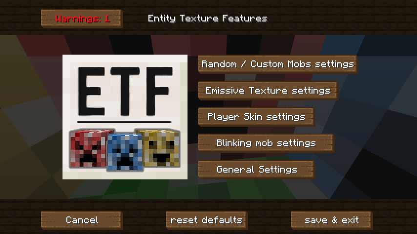

## Mod support

- This mod should be compatible with any mod added entities as long as they extend `LivingEntityRenderer` class for rendering and utilise it correctly
- Any mod displaying an entity in a custom GUI can force the default texture by having the `entity.getblockstate` set to either return `null` or `VOID_AIR`, the same can be achieved by settings the display mob's UUID to `UUID.nameUUIDFromBytes(("GENERIC").getBytes())`. 

## FAQ

> My entities are invisible/broken!

- Custom Entity Models is not a feature provided by ETF. If your entities are invisible or look corrupted you'll need to install my other mod [EMF](https://modrinth.com/mod/entity-model-features) (this includes resource packs such as Fresh Animations). Keep in mind that EMF is still in beta development and issues may still occur.

> Blocks and items are not emissive!

- ETF does not support emissive block and item texture, for that you'll need to install [Continuity](https://modrinth.com/mod/continuity).

> My game is lagging, help!

- If you are experiencing lag please check your most recent log file to see if any errors are being logged, sometimes an incorrectly written properties file or missing textures may lag the system.

> It doesn't work!

- Check if any issues are not actually a problem in the properties file, a few packs seem to be pointing to a texture that doesn't exist.
- So far all mob entities support random & emissive textures, but there may still be some quirks. If you find bugs you can either [report them in GitHub](https://github.com/Traben-0/Entity_Texture_Features/issues/new?assignees=Traben-0&labels=bug&template=bug_report.md&title=%5BBUG%5D+%22short+issue+description%22) or get support in the Discord server (linked on the top of the page).

> Emissives are broken with Complimentary shaders, what do I do?

- Complimentary shaders has its own in-built emissive textures that usually work fine but will conflict with some resource packs. You can either disable Complimentary's emissives or ETF's emissives to fix this.

> My question isn't here! 

- Feel free to check ETF's [Discord](https://discord.com/invite/rURmwrzUcz) to ask your questions or check the FAQ there :)

## Changelog

The changelog is available (for v4.1.1 & prior) on [CHANGELOG.md](../common/CHANGELOG.md).

## License

This mod is under the [GNU Lesser General Public License, v3.0](/LICENSE).
