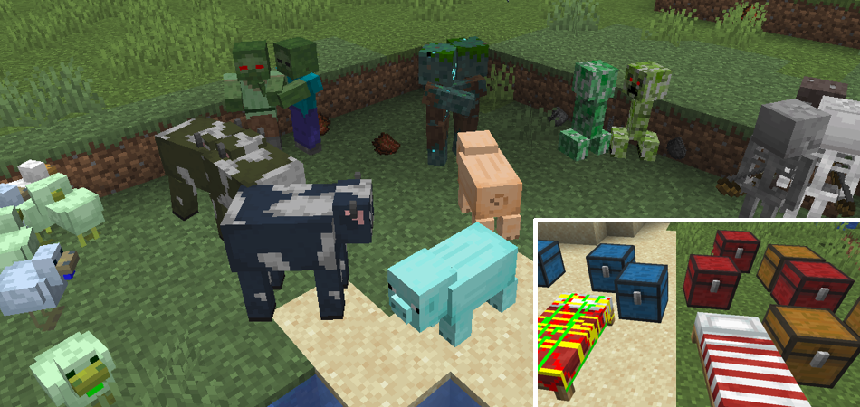
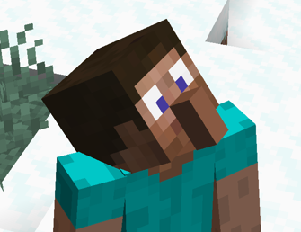

# Entity Texture Features

 [![Modrinth](https://img.shields.io/badge/dynamic/json?color=dark-green&label=downloads&prefix=+%20&query=downloads&url=https://api.modrinth.com/api/v1/mod/BVzZfTc1&logo=data:image/svg+xml;base64,PHN2ZyB4bWxucz0iaHR0cDovL3d3dy53My5vcmcvMjAwMC9zdmciIHZpZXdCb3g9IjAgMCAxMSAxMSIgd2lkdGg9IjE0LjY2NyIgaGVpZ2h0PSIxNC42NjciICB4bWxuczp2PSJodHRwczovL3ZlY3RhLmlvL25hbm8iPjxkZWZzPjxjbGlwUGF0aCBpZD0iQSI+PHBhdGggZD0iTTAgMGgxMXYxMUgweiIvPjwvY2xpcFBhdGg+PC9kZWZzPjxnIGNsaXAtcGF0aD0idXJsKCNBKSI+PHBhdGggZD0iTTEuMzA5IDcuODU3YTQuNjQgNC42NCAwIDAgMS0uNDYxLTEuMDYzSDBDLjU5MSA5LjIwNiAyLjc5NiAxMSA1LjQyMiAxMWMxLjk4MSAwIDMuNzIyLTEuMDIgNC43MTEtMi41NTZoMGwtLjc1LS4zNDVjLS44NTQgMS4yNjEtMi4zMSAyLjA5Mi0zLjk2MSAyLjA5MmE0Ljc4IDQuNzggMCAwIDEtMy4wMDUtMS4wNTVsMS44MDktMS40NzQuOTg0Ljg0NyAxLjkwNS0xLjAwM0w4LjE3NCA1LjgybC0uMzg0LS43ODYtMS4xMTYuNjM1LS41MTYuNjk0LS42MjYuMjM2LS44NzMtLjM4N2gwbC0uMjEzLS45MS4zNTUtLjU2Ljc4Ny0uMzcuODQ1LS45NTktLjcwMi0uNTEtMS44NzQuNzEzLTEuMzYyIDEuNjUxLjY0NSAxLjA5OC0xLjgzMSAxLjQ5MnptOS42MTQtMS40NEE1LjQ0IDUuNDQgMCAwIDAgMTEgNS41QzExIDIuNDY0IDguNTAxIDAgNS40MjIgMCAyLjc5NiAwIC41OTEgMS43OTQgMCA0LjIwNmguODQ4QzEuNDE5IDIuMjQ1IDMuMjUyLjgwOSA1LjQyMi44MDljMi42MjYgMCA0Ljc1OCAyLjEwMiA0Ljc1OCA0LjY5MSAwIC4xOS0uMDEyLjM3Ni0uMDM0LjU2bC43NzcuMzU3aDB6IiBmaWxsLXJ1bGU9ImV2ZW5vZGQiIGZpbGw9IiM1ZGE0MjYiLz48L2c+PC9zdmc+)](https://modrinth.com/mod/entitytexturefeatures)

## What does this mod do? 🤔

This Fabric & Forge mod adds support for many  _Entity Texture Features :trollface:_, including entity-related texture features and player skin features!  
This way, ETF provides more OptiFine parity on the Fabric mod loader. If you want more OptiFine features availiable on Fabric, you can either check [this list](https://lambdaurora.dev/optifine_alternatives), made by LambdaAurora, **or** you can use the [Fabulously Optimized modpack](https://modrinth.com/modpack/fabulously-optimized), which includes _all_ the OptiFine parity mods!

### Mod's features so far:

- 🎲 Custom & random entity textures with the OptiFine format, including biome, name, height and even more properties!
- 💡 Emissive/glowing entity textures with the OptiFine format
- 😑️ Blinking mobs
- ⚗️ Alternate potion visuals for mobs
- 🎨 Player skin features & additions, including support for most of the above features

## Compatibility

- OptiFine's random / custom or emissive entity texture resource packs - ✅ **Fully compatable**
- [Custom Entity Models mod](https://modrinth.com/mod/cem) - ✅ **Fully compatible**
- [Sodium](https://modrinth.com/mod/sodium) - ✅ **Fully compatible**
- [Iris Shaders](https://modrinth.com/mod/iris) - ✅ **Fully compatible** _(Support varies depending on the shader)_
- Mod added entities - ✅ **Compatible** _(only if the mod creator used the vanilla rendering code to render their mobs)_

## Wiki & Guides

### 🎲 Random / Custom entity textures - [OptiFine]

- For custom & random entity textures to work you can use a resource pack that supports the
**OptiFine format** for custom / random textures. ETF supports all OptFine custom and random entities, including all biome, height, name, etc. properties, and even more added by ETF!

#### [-> Random / Custom entity textures guide <-](README-assets/RANDOM_GUIDE.md)

### 💡 Emissive entity textures - [OptiFine]

- For emissive & random entity textures to work you can use a resource pack that supports the 
**OptiFine format** and includes emissive entity textures. 

#### [-> Emissive entity textures guide <-](README-assets/EMISSIVE_GUIDE.md)

### 🎨  Player skin features

 
 
 
 

- Player skins can use emissive, blinking, enchanted, transparency texture features, as well as other cosmetics like capes, jackets, dress extensions...
- They are 100% optional, controlled by the skin file you upload to Mojang, and options to prevent 
abuse of features in PvP

#### [-> Player skin features guide <-](README-assets/SKINS.md)

### 😑 Blinking textures

- Allows resource packs to add textures in order to make mobs blink over a customizable period of time.
- Mobs will blink periodically if they have a texture named `TEXTURE_blink.png`
- Optionally you can also use a texture named `TEXTURE_blink2.png` with the eyes half closed to achieve a smoother animation for large eyes
- Random blinking frequency can be altered in settings
- Sleeping mobs will have their eyes closed if possible
- Mobs with the blindness potion effect will have either their eyes closed or half closed depending on what is available
- Blinking _is_ supported on the player skin features
- Resource packs can set specific blinking length and frequency per texture via properties files next to the blinking texture:

### ⚗️ Alternate potion effects

- There's a setting in the mod which allows you to make it so mobs with potions effects can glow, appear enchanted or have creeper charge fields around them
- This was inspired by enchanted mobs in Minecraft Dungeons

## Settings & configuration

- Settings can be changed in-game using [Mod Menu](https://modrinth.com/mod/modmenu) or  by editing the config file, located under `config/entity_texture_features.json` 
- A few of these options can also be changed via the [Puzzle mod](https://modrinth.com/mod/puzzle)

## Mod Support

- This mod should be compatible with any mod added entities as long as they extend `LivingEntityRenderer` class for rendering and utilise it correctly
- Any mod displaying an entity in a custom GUI can force the default texture by having the `entity.getblockstate` set to either `null` or of type `VOID_AIR`

## FAQ

- Custom Entity Models is not a feature provided by ETF. If your entities are invisible or look corrupted you'll need to instal the [CEM mod](https://modrinth.com/mod/cem) (this includes resource packs such as Fresh Animations). Keep in mind that the CEM mod is still in alpha development and may still occur issues.
- ETF does not support emissive block and item texture, for that you'll need to install [Continuity](https://modrinth.com/mod/continuity).
- If you are experiencing lag please check your most recent log file to see if any errors are being logged, sometimes an incorrectly written properties file or missing textures may lag the system.
- Please check any issue is not actually a problem in the properties file, a few packs seem to be pointing to a texture that doesn't exist.
- So far all mob entities support random & emissive textures, but there may still be some quirks. If you find bugs you can either [report them in GitHub](https://github.com/Traben-0/Entity_Texture_Features/issues/new?assignees=Traben-0&labels=bug&template=bug_report.md&title=%5BBUG%5D+%22short+issue+description%22) or get support in the Discord server (linked on the top of the page).
- Complimentary shaders has its own in-built emissive textures that usually work fine but will conflict with some resource packs. You can either disable Complimentary's emissives or ETF's emissives to fix this.

