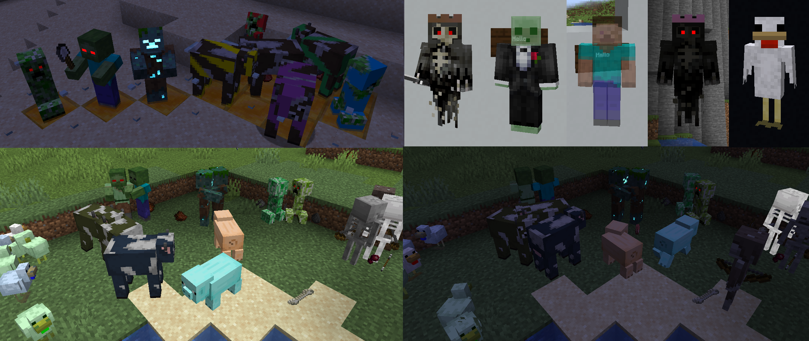
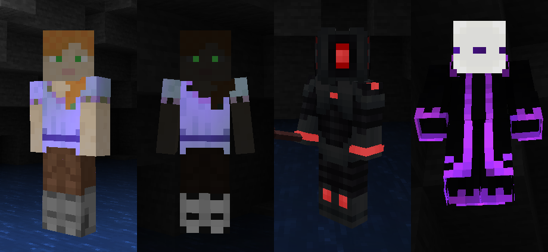
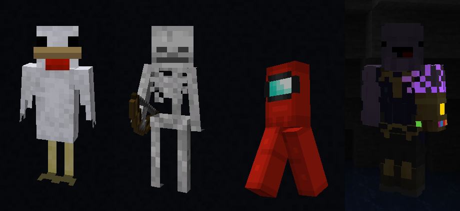
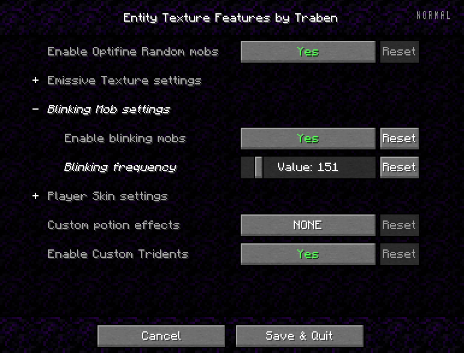

___
## A Minecraft Fabric Mod Including random, emissive textures for Mobs, Skins and much more...
### mostly using the Optifine Format but compatible with Sodium :)
#### ~ Now with 1.16.5  -> 1.18.2
___
### [[Discord]](https://discord.gg/rURmwrzUcz) - [[CurseForge]](https://www.curseforge.com/minecraft/mc-mods/entity-texture-features-fabric) - [[Modrinth]](https://modrinth.com/mod/entitytexturefeatures) - [[~~Compatability List~~]]() - [[Report Issues]](https://github.com/Traben-0/EmissiveMod/issues) - [[Donate]](https://www.paypal.com/donate/?business=PLB862YH8UXML&no_recurring=0&currency_code=AUD)
___

## What does this mod do? 🤔
This Client-side Fabric mod adds support for a bunch of entity texture features, 
including **Optifine Features**, that can be set in compatible **Resourcepacks** or **Player skins**.  
This allows most Optifine Resourcepacks to be used on Fabric, as long as they change 
**Textures only**, for Custom models *(Like Fresh Animations)* you will also need the 
[Custom Entity Models Mod](https://www.curseforge.com/minecraft/mc-mods/custom-entity-models-cem) 
and it's Dependencies.  
For more Fabric Optifine alternatives Click 
[[here]](https://lambdaurora.dev/optifine_alternatives/)
###The features of this mod so far:
- 🎲 Custom & Random entity textures just like Optifine & compatible with Optifine Resourcepacks. (Customised just like Optifine)
- 💡 Emissive/Glowing entity textures just like Optifine & compatible with Optifine Resourcepacks.
- 😑️ Blinking mobs
- 🔱 Custom Trident textures
- ⚗️ Alternate potion visuals for mobs
- 🎨 Player skin support for most of these features   
Everything can be enabled or disabled in the config or Mod Menu settings

##Compatability
- ✅ALL! Optifine Random / Custom or Emissive Entity resourcepacks
- ✅[@Motschen's Puzzle Mod](https://www.curseforge.com/members/motschen) **(fully compatible)**  *(just make sure to disable Puzzle's emissive texture in it's settings)*
- ✅[Custom Entity Models **(CEM)**](https://www.curseforge.com/minecraft/mc-mods/custom-entity-models-cem) **(fully compatible)** *(keep in mind CEM is in ALPHA and doen't support every model)*
- ✅[Sodium](https://www.curseforge.com/minecraft/mc-mods/sodium) **(fully compatible)**
- ✅[Mod Menu](https://www.curseforge.com/minecraft/mc-mods/modmenu) & Clothconfig *- optional*
- ✅[Iris Shaders](https://www.curseforge.com/minecraft/mc-mods/irisshaders) **(fully compatible)** *(Support varies depending on the shader)*
- ✅Mod added entities *(only if the mod creator used the vanilla rendering code to render their mobs)*

# Wiki / How to guides

## 🎲 Random / Custom entity textures - [Optifine]

- For custom & random entity textures to work you can use a resource-pack that supports the **Optifine format** for custom / random textures.  
- [~~***-> Random / Custom entity textures guide <-***~~](readMeAssets/RANDOM_GUIDE.md)

## 💡 Emissive entity textures - [Optifine]

- For emissive & random entity textures to work you can use a resource-pack that supports the **Optifine format** for emissive textures.  
  - [~~***-> Emissive entity textures guide <-***~~](readMeAssets/EMISSIVE_GUIDE.md)

## 🎨  Player skin features
  

  

- Player skins can use emissive, blinking, enchanted, and transparency texture features.
- 100% optional, controlled by the skin file you upload to Mojang, and options to prevent abuse of features in PVP
- Follow this guide to use these skin features
[***-> Player Skin Features guide <-***](readMeAssets/SKINS.md)

## 😑 Blinking feature

- Allows a textures to be set by a Resource-pack so that mobs can Blink periodically
- Mobs will blink periodically if they have a texture named "TEXTURE_blink.png"
- Optionally you can also use a texture named TEXTURE_blink2.png" with the eyes half closed to have a smoother animation for large eyes like creepers
- Blinking frequency can be altered in settings
- Sleeping mobs will have their eyes closed if possible
- Mobs with the Blindness potion effect will have either their eyes closed or half closed depending on what is available
- Player skins can support blinking, see player skin features...

## 🔱 Custom Trident textures

- Allows Trident textures to be set by a Resource-pack so they can be customized by name
- Tridents support custom and emissive textures, as of [V2.3.0], a trident item named "Bobby's Trident" will use the texture "trident_bobbys_trident.png"
- Option to disable it as CIT resewn mod may implement in the future, and this is only a quick implementation

## ⚗️ Alternate potion effects
- A setting in the config/mod menu settings, allows you to make it so mobs with potions effects can Glow, appear enchanted, or have creeper charge fields around them
- Mostly inspired by enchanted mobs in Minecraft Dungeons

## Settings & Configuration
- Settings can be changed in-game with Mod Menu, or the config file can be found at config/entity_texture_features.json

