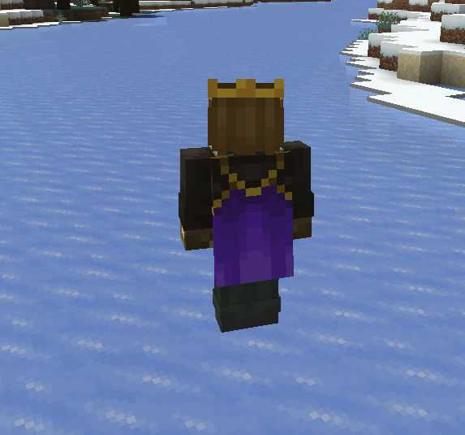

___
## A Minecraft Fabric Mod Including random, emissive textures for Mobs, Skins and much more...
### mostly using the Optifine Format but compatible with Sodium :)
#### ~ Now with 1.16.5  -> 1.18.2
___
### [[Discord]](https://discord.gg/rURmwrzUcz) - [[CurseForge]](https://www.curseforge.com/minecraft/mc-mods/entity-texture-features-fabric) - [[Modrinth]](https://modrinth.com/mod/entitytexturefeatures) - [[Report Issues]](https://github.com/Traben-0/EmissiveMod/issues) - [[Donate (Ko-Fi)]](https://ko-fi.com/traben)
___

## What does this mod do? 🤔
This Client-side Fabric mod adds support for a bunch of entity texture features, 
including **Optifine Features**, that can be set in compatible **Resourcepacks** or **Player skins**.  
This allows most Optifine Resourcepacks to be used on Fabric, as long as they change 
**Textures only**, for Custom models *(Like Fresh Animations)* you will also need the 
[Custom Entity Models Mod](https://www.curseforge.com/minecraft/mc-mods/custom-entity-models-cem) 
and it's Dependencies.  
For more Fabric Optifine alternatives Click 
[[here]](https://lambdaurora.dev/optifine_alternatives/)
### The features of this mod so far:
- 🎲 Custom & Random entity textures just like Optifine & compatible with Optifine Resourcepacks. 
(Customised just like Optifine, by Biome, Name, Height, etc. with even more properties)
- 💡 Emissive/Glowing entity textures just like Optifine & compatible with Optifine Resourcepacks.
- 😑️ Blinking mobs
- ⚗️ Alternate potion visuals for mobs
- 🎨 Player Skin Features & Additions, including support for most of the above features 

Everything can be enabled or disabled in the config or Mod Menu settings

---
## Compatibility
- ✅ALL! Optifine Random / Custom or Emissive Entity resourcepacks
- ✅[Custom Entity Models **(CEM)**](https://www.curseforge.com/minecraft/mc-mods/custom-entity-models-cem)
  **(fully compatible)** *(keep in mind CEM is in ALPHA and doesn't support every model)*
- ✅[Sodium](https://www.curseforge.com/minecraft/mc-mods/sodium) **(fully compatible)**
- ✅[Mod Menu](https://www.curseforge.com/minecraft/mc-mods/modmenu) & Clothconfig *- optional*
- ✅[Iris Shaders](https://www.curseforge.com/minecraft/mc-mods/irisshaders) **(fully compatible)** 
*(Support varies depending on the shader)*
- ✅Mod added entities *(only if the mod creator used the vanilla rendering code to render their mobs)*
---
# Wiki & How to guides

---

## 🎲 Random / Custom entity textures - [Optifine]

- For custom & random entity textures to work you can use a resource-pack that supports the
  **Optifine format** for custom / random textures, including all Biome, Height, Name, etc. properties settings. and
  even more added by ETF
  - [***-> Random / Custom entity textures guide <-***](readMeAssets/RANDOM_GUIDE.md)

---
## 💡 Emissive entity textures - [Optifine]

- For emissive & random entity textures to work you can use a resource-pack that supports the 
**Optifine format** for emissive textures.   
  - [***-> Emissive entity textures guide <-***](readMeAssets/EMISSIVE_GUIDE.md)

---
## 🎨  Player skin features
 
 
 
 

- Player skins can use emissive, blinking, enchanted, transparency texture features, 
as well as other things like capes & jacket / dress extensions.
- these are 100% optional, controlled by the skin file you upload to Mojang, and options to prevent 
abuse of features in PVP
- Follow this guide to use these skin features
  - [***-> Player Skin Features guide <-***](readMeAssets/SKINS.md)
  - join the [[Discord]](https://discord.gg/rURmwrzUcz) if you still need help :)

---
## 😑 Blinking feature

- Allows a textures to be set by a Resource-pack so that mobs can Blink randomly over a set period
- Mobs will blink periodically if they have a texture named "TEXTURE_blink.png"
- Optionally you can also use a texture named "TEXTURE_blink2.png" with the eyes half closed to have a smoother
  animation for large eyes like creepers
- Random blinking frequency can be altered in settings
- Sleeping mobs will have their eyes closed if possible
- Mobs with the Blindness potion effect will have either their eyes closed or half closed 
depending on what is available
- Player skins can support blinking, see player skin features...
- Resource-packs can set specific blinking length and frequency per texture via properties files
next to the blinking texture, see below:  
  

---
## ⚗️ Alternate potion effects
- A setting in the config/mod menu settings, allows you to make it so mobs with potions effects can Glow, 
appear enchanted, or have creeper charge fields around them
- Mostly inspired by enchanted mobs in Minecraft Dungeons

---
## Settings & Configuration
- Settings can be changed in-game with Mod Menu, or the config file can be found at 
config/entity_texture_features.json
- A few of these options can also be changed via the Puzzle mod

## Mod Support
- This mod should be compatible with any Mod added entities as long as they extend LivingEntityRenderer.class for rendering and utilise it correctly
- Any mod displaying an entity in a custom gui can force the default texture by having the entity.getblockstate be either null or of type VOID_AIR
- Settings can be altered ingame with Mod Menu
- fully supports iris but can vary between shaders
- fully sodium compatible

## Known Bugs

- if you are experiencing LAG please check your most recent log file to see if any errors are being logged, sometimes an
  incorrectly written properties file or missing textures may lag the system.
- Please check any issue is not actually a problem in the properties file, a few packs seem to be pointing to a texture
  that doesn't exist.

- So far all Mob Entities support Random & Emissive textures though there may still be some quirks, if you find bugs you
  can reach me on the mod's [Discord](https://discord.gg/rURmwrzUcz)
- Complimentary shaders has its own inbuilt emissive textures that usually work fine but will conflict with some
  resource-packs *(you can disable either complimentary's emissives or my mods emissives to fix this).*

