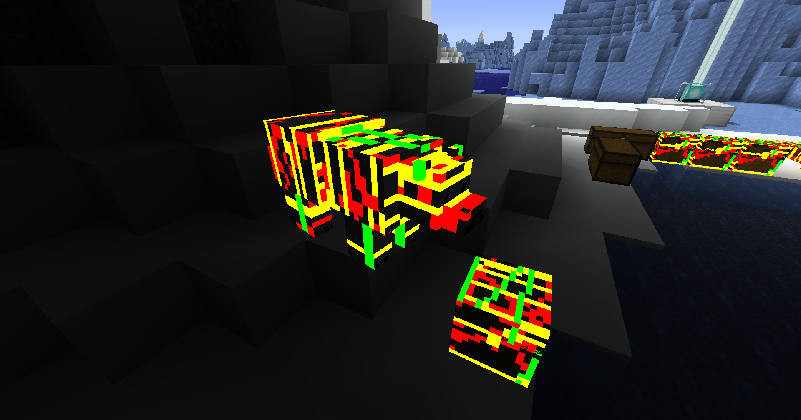

# 💡Emissive Textures Guide:

---
### This mod is completely Optifine format compatible!!!!

- It supports all optifine Emissive Texture Resource-packs

---
## The Guide:

- Emissive textures allow parts of a mob / entity's texture to glow as in the above image

- Emissive textures must be in the same folder as the texture it is glowing over and must be named like (
  TextureName#.png)
  *(with "#" being the suffix set by the topmost optifine format resourcepack, it will otherwise default to "_e" meaning
  the file name should be (TextureName_e.png)*

- Elytra & Armour emissives have CIT Resewn mod support and will apply based on the CIT texture
- Tridents support emissive textures customized via the special case rules in the Random / Custom mob Guide

- Player Skin Features support emissive textures, see [Player Skin Features Guide](SKINS.md)

### Emissive textures can render in two different ways set by the config or mod-menu options the two images below show the two rendering modes:

<table>
<tr>
<td>

</td>
<td>

This image shows an example of the *"Dull"* rendering mode

- will **not** implicitly support shaders *(E.G shaders likely wont glow or bloom these emissives)*
- has directional light shading *(some sides are shaded differently)*
- has an upper brightness limit more inline with typical entity rendering
- Block entities will always use this mode unless iris is installed *(due to rendering issues in vanilla)*

</td>
</tr>
</table>
<table>
<tr>
<td>

</td>
<td>

This image shows an example of the Default *"Bright"* rendering mode

- supports shaders *(E.G shaders likely will glow or bloom these emissives by default)*
- has global illumination and does not shade differently over the model
- brighter than Dull mode

</td>
</tr>
</table>

---

## Examples

- The example image above shows red glowing eyes for the texture *"zombie3.png"*
- Emissives are applied after randomised textures they must contain the same number system as the random files they
  apply too  
  *(e.g "zombie_e.png" will not apply to "zombie3.png" but "zombie3_e.png" will)*
