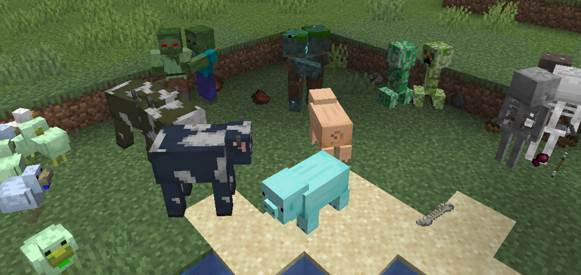
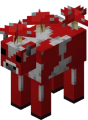
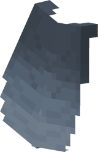
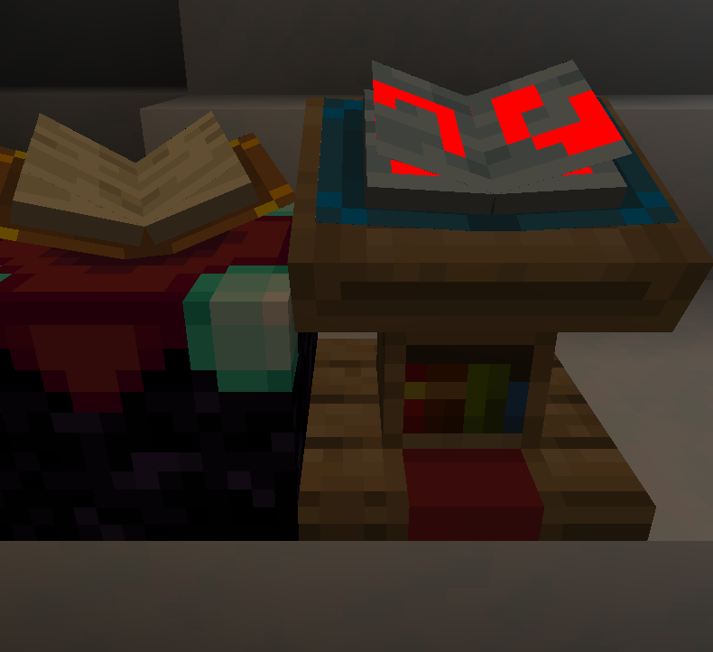
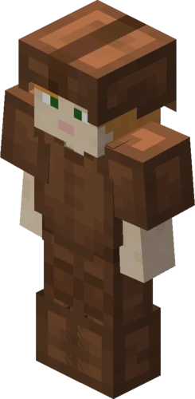

# 🎲 Custom / Random / Varied Entity Textures Guide:

---
### This mod is completely Optifine format compatible!!!!

- ETF supports all optifine random entity texture properties including Biomes, Names, Heights, etc...
  *(ETF also adds some of its own)*
- For documentation see the [ETF random entities format doc](random_entities.properties)
- For examples try any optifine or ETF random mob resource-packs, and it will work.
- This mod also adds a few extra features that Optifine does not have, Most notably you can put everything in the
  default *"minecraft/textures/entity"* or the *etf/random* directory as well as Optifine's directories

---
## Guide & how it works:

- Random textures are applied to each mob on the client-side  
  *(based on it's UUID, meaning that mob will always have the same random texture unless texture packs are changed, this
  will even be the same between players if they have the same packs.)*

- Random textures **must** be in one of the following folders in the resource-pack, and will be checked from the top
  directory first, only using the last directory if none of the others are used
  - the ETF override directory *"etf/random/entity"*
  - the Optifine Random directory *"optifine/random/entity"* ****Highly Recommended***
  - the Optifine legacy directory *"optifine/mob"*
  - the Vanilla directory *"minecraft/textures/entity"*

- the random textures **must** be named like *"TextureName#.png"* with # being any number that **must** start from 2,  
  *(if 1.png does not exist then calling 1 in the properties will use the vanilla texture, the vanilla texture can also
  be manually called by using the number 0 in the properties)*
- A *"TextureName.properties"* file can be placed alongside these random textures to determine special cases for
  different random textures to be selected, this properties file must support
  the [ETF / Optifine format](random_entities.properties)
  and if one isn't present the game will instead pick randomly from the available random textures present.   
  *(Note. when randomly picked like this, the random textures must contain numbers in sequence from 2 -> however many
  there are, if there are any gaps then textures after the gap will be ignored)*
- The properties file functions just as it does with Optifine and if a specific entity does not match any of the
  conditions in the properties file it will default to the vanilla texture.
- This mod also adds a few texture Properties "names", "blocks" & "teams", as well as extending "colors" and other minor
  tweaks
- The "names" property works exactly the same as the "name" property except it will allow you to set multiple names for
  a condition a little easier
- The "blocks" property works exactly the same as the "biomes" property except it will allow you to set the texture of
  the entity based on the block it spawned on
  *(or first rendered on)* instead of the Biome, an example of the "blocks" property follows:  
  *blocks.1= stone !bedrock minecraft:stone mod_name:marble*
- The "teams" Property works exactly the same as the "names" property except it will allow you to set the texture of the
  entity based on the scoreboard team it is in
  *(this will be useful for data-pack creators or map-makers who do not want the mob to display a custom name)*    
  an example of the "teams" property follows:  
  *teams.1= !red_team "Blue Team" blue_team*
- Additionally, the Names & Teams property support grouping names that have spaces within double quotes e.g "John Smith"
- Mobs with additional textures like "sheep & wool", "horse & markings & armour", iron_golem & cracking textures, etc. 
will have the additional texture try and match whatever variant the main texture uses. *(e.g. a sheep using "sheep2.png will
try and use wool2.png and if that doesn't exist it will use the default texture)*
- Villagers are the exception to the above rule and each texture for villagers will apply their own rules, whether they be randomly assigned or set by a .properties file

---
## Example properties file

- The example image above shows that any zombie in a desert will have a 10/17 chance of using "zombie1.png"
- it also shows that any zombie not in a (desert,plains,jungle,nether) biome and is named "John" will always use
  texture "zombie3.png"
- it also shows that any zombie in a taiga biome, without the above names from the previous category, and standing at
  y-level 45 will be texture "zombie1.png"
- "zombie3.png" also has an emissive texture "zombie3_e.png", that will make its eyes glow red

- Certain conditions in the properties file will update the mobs texture, based on the texture update speed, when
  changes are detected, these are:
  *("name", "profession", "collarColors", "baby", "health", "teams")*.
- All the other conditions such as "biomes" & "blocks" will by default only be applied to the Mob when it first spawns / loads.  
*(for example a Zombie spawned in a desert will take the "desert skin" and it will not change to the "forest skin" 
when they walk into a forest biome.)*  
- This can be disabled by the config option "Property update restrictions" for each of these properties individually.  
  *(if update restrictions are disabled for biomes, the above example Zombie with the "desert skin" would indeed change
  to the "forest skin"
  upon entering a forest biome)*

- Entities with multiple textures like Wolves, Bees or Ghasts should be given the same amount of random variant textures
  for each texture variant

---

## Special Cases

<table>
<tr>
<td>

</td>
<td>

- Chests and beds are Block Entities and can be customized with the same properties format as optifine does for other
  entities
- *Note:* Most Block Entity optimization fabric mods like ***Enhanced Block Entities*** or ***BetterBeds***, will
  disable this feature in favour of faster rendering
- *Note:* The name property for chests and other block entities will not work on servers, unless the server has a mod
  like [Know my name!](https://modrinth.com/mod/know-my-name)

</td>
</tr>
<tr>
<td>

</td>
<td>

- Tridents support custom textures, as of *[V2.3.0]*, a trident item named *"Bobby's Trident"* will use the texture *"
  trident_bobbys_trident.png"*
- A named trident will match any texture of the format *trident_"customName".png*, with customName being the name of the
  trident with spaces replaces with "_" and any non letters ignored.
- Custom trident support will be removed if implemented in a mod like CIT.

</td>
</tr>
<tr>
<td>

</td>
<td>

- If a custom mushroom texture is placed in *"minecraft/textures/entity/cow/red_mushroom.png"* or 
*"minecraft/textures/entity/cow/brown_mushroom.png"*, it will overwrite the mushrooms on the back
of the respective mooshroom.

</td>
</tr>
<tr>
<td>

</td>
<td>

- Custom elytras are handled by the CIT resewn mod, and may utilise ETF emissive textures only
- You can also use the Player skin feature options for custom capes to have a custom elytra, this supports emissive
  elytras

</td>
</tr>
<tr>
<td>

</td>
<td>

- Shulkers **will only** use the base un-coloured shulker.properties for custom settings (**not**
  shulker_black.properties), the other coloured textures will still apply as the default to those entities when spawned
  via commands
- Shulker Boxes **WILL** use *shulker.properties* **OR** *shulker_black.properties* depending on the shulker box colour
- if you would like to prevent wild shulkers from using custom textures intended for shulker boxes try using the
  following at the start of shulker.properties

<table><tr><td>
skins.1=1 
biomes.1=the_end 
</td></tr></table>

- this should make all shulkers and shulker boxes in "the end" appear as default, you can find an example in the example
  ETF_vanilla resourcepack.
- Note: Most Block Entity optimization fabric mods like Enhanced Block Entities, will disable this feature in favour of
  faster rendering
- *Note:* The name property for shulker boxes and other block entities will not work on servers, unless the server has a
  mod like [Know my name!](https://modrinth.com/mod/know-my-name)

</td>
</tr>
<tr>
<td>

</td>
<td>

- If a custom book texture is placed in *"minecraft/textures/entity/lectern_book.png"*, it will overwrite the book of
  the lectern block

</td>
</tr>
<tr>
<td>

</td>
<td>

- Armor can be customized using the CIT mod only as it allows greater customization and makes more sense as the armor is
  an 'item'
- ETF will provide emissive support for CIT customised armor textures

</td>
</tr>
</table>
