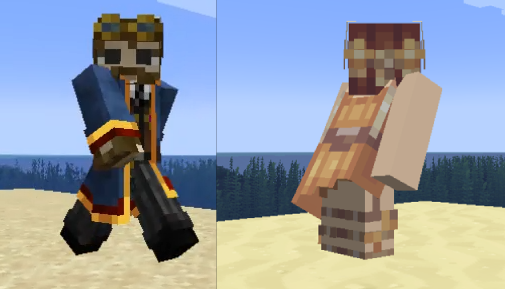
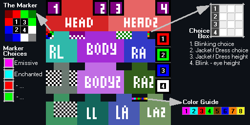
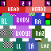

# 🎨  Player skin features Guide
  

  




all of these examples are downloadable [[HERE]](https://github.com/Traben-0/EmissiveMod/raw/master/Skin_Feature_Examples.ZIP)
- Player skins can use emissive, blinking, enchanted, and transparency texture features and more...
- 100% optional, controlled by the skin file you upload to Mojang, and options to prevent abuse of features in PVP

# How can you do this?
## The Example Skin File
###### *Not as scary as it looks all will be explained below*
  

[*Downloadable example skin*](mod_data_example.png)  

## Getting started
- First of all to enable the skin features in this mod you **must** put the marker in your skin file,
  this is the red,green,blue,white,black pixels just below the head texture in the example image above.
- This mod will ignore any skin without this so no one else can affect **YOUR** skin
- You will select your marker choices later these will be selected by putting specific
colour pixels in the boxes #1 - #4 in the marker
- The choices Box is the box to the left of the red #1 box in the example
you will fill this in later with specific pixel colours to select options for your skin
- The Color Guide is not required - it is provided in the skin for you to grab the specific
colors required for later choices. *(Note: each color corresponds to a number, this will be used later)* 

- It is **highly** recommended you leave every unused space ion your skin texture blank and transparent,
if you have stray pixels filled they may trigger future features 

- I will promise now. As long as you leave unused parts of your skin file 
blank and transparent no future update will impact your skin unexpectedly.

## Transparency - [V2.3.0+]
- If the marker is present in your skin, you will then be able to use transparency in
the head, body,RLeg, LLeg,RArm, and LArm, body parts (this is disabled in vanilla).
- The total skin can not be less than 40% average transparency to prevent possible PVP abuse
an option may be added to override this for fun in future
- See examples above in the Ghost, Slime, Steve, Chicken, Skeleton, and Among us skins
can be seperately Disabled for enemy team players so as to not be abused in PVP settings
## Emissiveness - [V2.3.0+]
- If the marker is present in your skin, you will then be able to use emissiveness in your skin
- To enable Emissiveness you **must** choose **only one** numbered pixel 
in the marker and give it the Emissive color *(the pink in the marker choices list)  
(for example putting the pink color in #1 in the marker will select all the pixels in the red box to the right side of the skin with a #1 in it, and select it for emissives)*
- After choosing a spot in the marker, any pixels present in the chosen 
square of the same number, to the right of the skin, will be matched against
the rest of the skin, and any matching pixels of the exact same colour & opacity will glow
- See examples above in the Ghost, Robot, and Thanos's gauntlet
## Enchanting - [V2.3.0+]
- If the marker is present in your skin, you will then be able to use enchanting visuals in your skin
- To enable Enchanted visuals you **must** choose **only one** numbered pixel
   in the marker and give it the Enchanted color *(the cyan in the marker choices list)   
(for example putting the cyan color in #2 in the marker will select all the pixels in the green box to the right side of the skin with a #2 in it, and select it for enchanting)*
- After choosing a spot in the marker, any pixels present in the chosen
  square of the same number, to the right of the skin, will be matched against
the rest of the skin, and any matching pixels of the exact same colour & opacity will appear enchanted on your skin
- See examples above in the Alex, robed figure, and Thano's arm skins
## Blinking - [V2.3.0+]
- If the marker is present in your skin, you will then be able to have your skin blink periodically
but you must also choose what kind of blinking, many skins have large eyes, so to smooth out blinking you can have either
- 1 frame of blinking (eye open & eye closed) or 2 frames (eye open & eye half closed & eye closed)
- to select one you must change the colour of the #1 Black pixel in the Choice Box in the example above
- to Select 1 frame you must use exactly the Pink pixel #1 from the Color Guide, for 2 frames use the Light Blue #2 if neither of these are used the skin will not blink
- Once this is done you can now add blinking textures to your skin, make a copy of the front of your face and put it in the purple box with a black outline
make this face have it's eyes completely closed
- Repeat with the extra head layer for your face and put that in the purple box with the black outline and diagonal line, just incase you have popout eyes
if you have selected a 2 frame blink repeat this process with the dark green boxes with black borders except this time make the eyes half closed
- In the [example skins download pack](https://github.com/Traben-0/EmissiveMod/raw/master/Skin_Feature_Examples.ZIP) you can see these on the Chicken & Slime Tuxedo
## Jacket / Dress Extensions - [V2.4.0+]


- This feature provides extension options for how minecraft renders the 'Jacket' layer of your minecraft 
skin *(the second layer that floats above your body)* and allows it to go up to 8 pixels further down
- Typical uses could be for Jackets, Dresses, Villager cloaks and Robes.
- The texturing is extremely straight forward, if enabled this feature will copy the contents of the top of the
Legs floating skin layers and use them to build the extension *(these pixels are marked by a checkerboard pattern in the example image above)*.

To enable this feature **must** choose what ***Style*** of extension you want.  
This is done by putting a pixel of your choice in Choice Box #2, the numbers below correspond to the
colored pixels in the Color Guide
```
1. you will get the examples above where the extension is copied from the legs which will still have the original texture.
2. the extension is still copied from the legs, but it will also delete those pixels from the leg texture itself leaving them clear.
3. same as #1 but with a wider extension
4. same as #2 but with a wider extension
```
Next you **must** choose what ***Length*** of extension you want.  
This is done by putting a pixel of your choice in Choice Box #3, The color of pixel you choose must
be one from the Color Guide.
The number for that color in the Color Guide will be the extension length from 1 to 8 pixels.


.  
.  
.  
.  
.  
.  
.  
.  
.  
.  
.